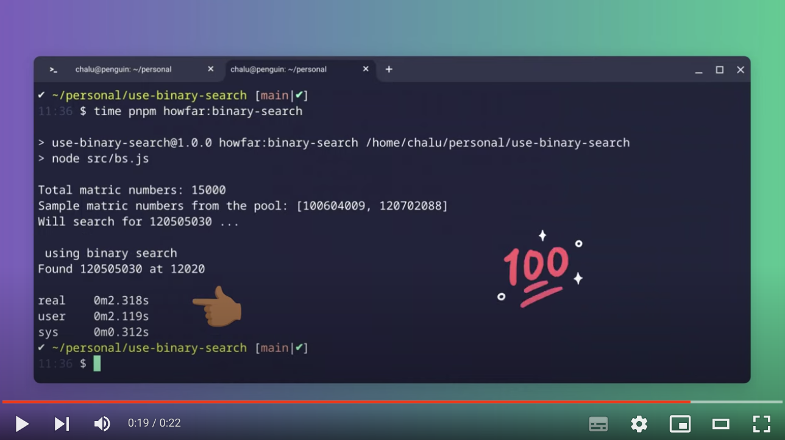

## Example use of Binary Search algorithm

### Usage

> you will need npm or pnpm installed

1.  clone/download the repository and `cd` into it on the command line
2.  Run it
    -   NPM `npm run howfar:binary-search` or `time npm run howfar:binary-search`
    -   PNPM  `pnpm howfar:binary-search` or `time pnpm howfar:binary-search`

### Demo
> https://youtu.be/WRqbrPPQ9DU

